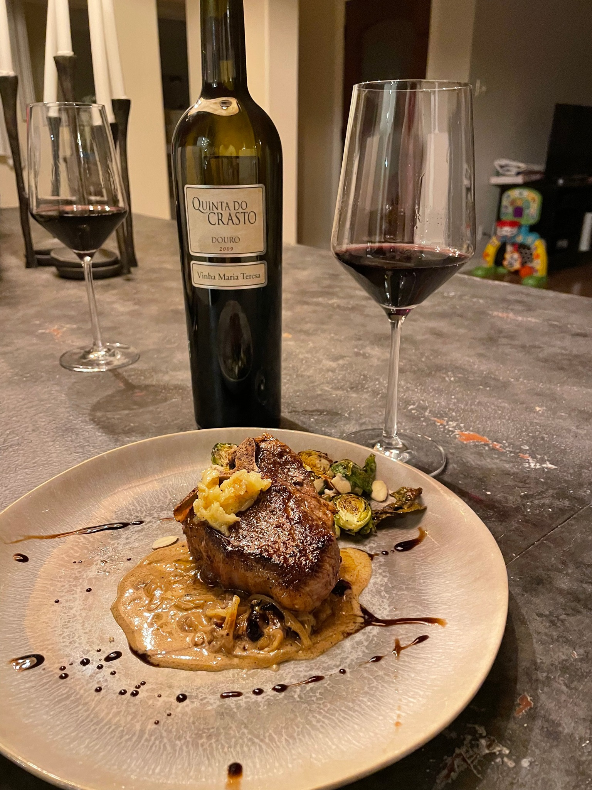

# Shallot and Cranberry Cream Sauce
## About

## Tags
#light #creamy #mildly-sweet

## Pairings
[[Lamb]], [[Duck]]

## Image

## Ingredients
- 1 Shallot - thinly sliced
- 2 Tablespoons butter
- 1 Tablespoon olive oil
- 1 spritz of dry white wine or white wine vinegar 
- Small handful dried cranberries
- 1/4 cup heavy cream
- 1/4 cup chicken stock
- salt and black pepper to taste

## Recipe
1. Sautee shallot in butter and olive oil low and slow, until fragrant, translucent, and golden: ~20-30 min
2. Add dried cranberries and splash with white wine, burning off alcohol if present
3. After the wine has reduced by 1/2, stir in heavy cream and chicken stock, season, bring to a simmer, and reduce until desired consistency
	- Aim for a consistency where the sauce lightly coats the back of a spoon

